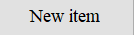

# Представление результатов

| ID | Назначение/название | Сценарий | Ожидаемый результат | Фактический результат | Оценка |
|:---:|:---:|:---|:---|:---|:---|
| 1 | Создание нового объекта списка фильма/книги | 1. Нажмите на кнопку "New item" ([см. рисунок 1](#1)), которая расположена на главной форме ([см. рисунок 2](#2)). 2. в очистившихся полях панели "Info" введите данные в соответствующие поля: name ("Зеленая миля"); Date ("1999"); Authors("Фрэнк Дарабонт"); Country("США"); Descriptions("Пол Эджкомб не верил в чудеса. Пока не столкнулся с одним из них"); Для добавления обложки в поле для изображения Artcover надо нажать кнопку "Load new" ([см. рисунок 3](#3)), в появившемся окне выбрать нужное изображение на своем компьютере и нажать "открыть". 3. Подтвердите ввод нажатием на кнопку "New item" ([см. рисунок 1](#1)). | Появилось окно "new item added" ([см. рисунок 4](#4)). На панели "Movies/Books" появился новый объект списка с названием "Зеленая миля" который вводили в поле "Name", а панель "Info" очистилась для создания нового объекта. Введённые данные нового объекта списка Movies/Books добавлены в Json файл и при выборе этого объекта отображены на панели "Info". | Появилось окно "new item added" ([см. рисунок 4](#4)). На панели "Movies/Books" появился новый объект списка с названием "Зеленая миля" который вводили в поле "Name", а панель "Info" очистилась для создания нового объекта. Введённые данные нового объекта списка Movies/Books добавлены в Json файл и при выборе этого объекта отображены на панели "Info". ([см. рисунок 5](#5)). | Успешно |
| 2 | Контекстный поиск по имени | 1. Активируйте поисковую строку ([см. рисунок 6](#6)), которая находится в верхней части главной формы ([см. рисунок 7](#7)). 2. На панели "Search parametrs" ([см. рисунок 8](#8)) выберите критерий поиска Name. Введите свой запрос ([см. рисунок 9](#9)) и нажмите кнопку "Search" ([см. рисунок 10](#10)). | Появиться окно "Search" с результатоми поиска в соответствии с выбранным критерием. При выборе любого из найденных результатов двойным кликом на понели "Info" поля заполнятся в соответствии с выбранным объектом. Окно "Search" закрывается по нажатию кнопки "Close".| Появиться окно "Search" ([см. рисунок 11](#11)) с результатоми поиска в соответствии с выбранным критерием. При выборе любого из найденных результатов двойным кликом, на понели "Info" поля заполнятся в соответствии с выбранным объектом ([см. рисунок 12](#12)). Окно "Search" закрывается по нажатию кнопки "Close"([см. рисунок 13](#13)), ([см. рисунок 14](#14)). Поиск чувсвителен к регистру. | Успешно |
| 3 | Контекстный поиск по дате| 1. Активируйте поисковую строку ([см. рисунок 6](#6)), которая находится в верхней части главной формы ([см. рисунок 7](#7)). 2. На панели "Search parametrs" ([см. рисунок 15](#15)) выберите критерий поиска Date. Введите свой запрос ([см. рисунок 16](#16)) и нажмите кнопку "Search" ([см. рисунок 10](#10)). | Появиться окно "Search" с результатоми поиска в соответствии с выбранным критерием. При выборе любого из найденных результатов двойным кликом на понели "Info" поля заполнятся в соответствии с выбранным объектом. Окно "Search" закрывается по нажатию кнопки "Close".| Появиться окно "Search" ([см. рисунок 17](#17)) с результатоми поиска в соответствии с выбранным критерием. При выборе любого из найденных результатов двойным кликом, на понели "Info" поля заполнятся в соответствии с выбранным объектом. Окно "Search" закрывается по нажатию кнопки "Close"([см. рисунок 13](#13)), ([см. рисунок 18](#18)). Поиск чувсвителен к регистру. | Успешно |
| 4 | Контекстный поиск по | 1. Активируйте поисковую строку ([см. рисунок 6](#6)), которая находится в верхней части главной формы ([см. рисунок 7](#7)). 2. На панели "Search parametrs" ([см. рисунок 15](#15)) выберите критерий поиска Date. Введите свой запрос ([см. рисунок 16](#16)) и нажмите кнопку "Search" ([см. рисунок 10](#10)). | Появиться окно "Search" с результатоми поиска в соответствии с выбранным критерием. При выборе любого из найденных результатов двойным кликом на понели "Info" поля заполнятся в соответствии с выбранным объектом. Окно "Search" закрывается по нажатию кнопки "Close".| Появиться окно "Search" ([см. рисунок 17](#17)) с результатоми поиска в соответствии с выбранным критерием. При выборе любого из найденных результатов двойным кликом, на понели "Info" поля заполнятся в соответствии с выбранным объектом. Окно "Search" закрывается по нажатию кнопки "Close"([см. рисунок 13](#13)), ([см. рисунок 18](#18)). Поиск чувсвителен к регистру. | Успешно |
| 7 | Переключение критерия сортировки по алфавиту | 1. Найдите переключатель сортировки по алфавиту ([см. рисунок 19](#19)), который расположен на панели "Глобальный поиск"(Главная форма) ([см. рисунок 8](#8)). 2. Выбрать положение переключателя "от Я до А" ([см. рисунок 21](#21)). 3. Выбрать положение переключателя "от А до Я" ([см. рисунок 20](#20)). | Сначала список контактов отсортируется в обратном алфавитном порядке, а затем в алфавитном порядке. | Сначала список контактов отсортируется в обратном алфавитном порядке ([см. рисунок 22](#22)), а затем в алфавитном порядке ([см. рисунок 23](#23)). | Успешно |
| 8 | Осуществление перехода по списку контактов | 1. Найдите блок кнопок перехода по списку контактов ([см. рисунок 24](#24)), который расположен на панели "Глобальный поиск"(Главная форма) ([см. рисунок 8](#8)). 2. Нажмите на кнопку "Вперёд" ([см. рисунок 25](#25)). 3. Нажмите на кнопку "К концу списка" ([см. рисунок 26](#26)). 4. Нажмите на кнопку "Назад" ([см. рисунок 27](#27)). 5. Нажмите на кнопку "К началу списка" ([см. рисунок 28](#28)). | По умолчанию активирована и подробно отображена на панели "Блок данных о контакте", первая запись в списке контактов. При нажатии на кнопку "Вперёд" активируется следующая в списке контактов запись. При нажатии кнопки "К концу списка", активируется последняя в списке контактов запись. При нажатии кнопки "Назад", активируется предыдущая в списке контактов контактов запись. При нажатии на кнопку "К началу списка", активируется первая в списке контактов запись. | По умолчанию активирована и подробно отображена на панели "Блок данных о контакте", первая запись в списке контактов ([см. рисунок 5](#5)). При нажатии на кнопку "Вперёд" ([см. рисунок 25](#25)) активируется следующая в списке контактов запись ([см. рисунок 29](#29)). При нажатии кнопки "К концу списка" ([см. рисунок 26](#26)), активируется последняя в списке контактов запись ([см. рисунок 30](#30)). При нажатии кнопки "Назад" ([см. рисунок 27](#27)), активируется предыдущая в списке контактов контактов запись ([см. рисунок 31](#31)). При нажатии на кнопку "К началу списка" ([см. рисунок 28](#28)), активируется первая в списке контактов запись ([см. рисунок 5](#5)). | Успешно |
| 9 | Вызов руководства пользователя | 1. Нажмите соответствующую кнопку ([см. рисунок 32](#32)). | Отображается руководство пользователя. | Отображается руководство пользователя ([см. рисунок 33](#33)). | Успешно |
| 10 | Активация контакта напрямую через панель "Список контактов" (Главня форма) | 1. Активируйте ячейку любой неактивной записи ([см. рисунок 34](#34)) на панели "Список контактов" (Главня форма) . 2. Активируйте ячейку любой другой неактивной записи ([см. рисунок 35](#35)) на панели "Список контактов" (Главня форма). | Активна ячейка автоматически активирует контакт. | Активная ячейка автоматически активирует контакт. | Успешно |
| 11 | Редактирование данных контактов сразу на панели "Список контактов" (Главная форма)| 1. Активируйте любую ячейку ([см. рисунок 35](#35)) на пенели "Список контактов" (Главная форма). 2. Попытайтесь удалить, изменить или дополнить информацию в этой активной ячейке. | Программа не позволила на прямую удалять, изменять или дополнять информацию в этой активной ячейке. | Программа не позволила на прямую удалять, изменять или дополнять информацию в этой активной ячейке. | Успешно |
| 12 | Редактирование данных активного контакта сразу на панели "Блок данных о контакте" (Главная форма) | 1. Активировать любое поле активного контакта на панели "Блок данных о контакте" (Главня форма) ([см. рисунок 36](#36)), путём установки курсора в оную ([см. рисунок 37](#37)). 2. Попробуйте удалить, изменить или дполнить информацию в этом поле. | Программа не позволяет на прямую удалять, изменять или дополнять информацию в поле на панели "Блок данных о контакте" (Главная форма). | Программа не позволяет на прямую удалять, изменять или дополнять информацию в поле на панели "Блок данных о контакте" (Главная форма). | Успешно |
| 13 | Осуществление тонального набора | 1. Нажать на кнопку с соответствующей иконкой ([см. рисунок 38](#38)) (появится окно с информационным сообщением). 2. Перевести телефон в тональный режим. 3.  Поднести телефон к динамику устройства. 4. Нажать кнопку "ОК" в появившемся информационном сообщении ([см. рисунок 39](#39)). | Окно с информационным сообщением скрылось. Осуществился тональный набор телефонного номера. | Окно с информационным сообщением скрылось. Осуществился тональный набор телефонного номера. В случае неправильного набора телефонного номера появится соответствующее информационное сообщение ([см. рисунок 40](#40)). | Успешно |
| 14 | Редактирование активного контакта | 1. Нажмите на кнопку "Редактировать" ([см. рисунок 41](#41)), которая расположена на главной форме. 2. В появившемся окне "Редактирование контакта" ([см. рисунок 42](#42)) удалите, измените или дополните информацию в соответствующих полях по категориям: Фамилия ("Иванов"->"Петров"); Имя ("Иван"->"Пётр"); Отчество ("Иванович"->"Петрович"); Мобильный телефон ("80299586834"->"80339243569"); Город ("Минск"->"Жодино"); Улица ("Васильева"->"Лермантова"); Дом ("15"->"17"); Корпус ("-"->"а"); Квартира ("18"->"314"); Домашний телефон ("80172045447"->"80176423546"); Организация (ООО "Акцент"->ООО "Ваш дом"); Должность ("Контролёр ОТК"->"Слесарь КИПа"); Рабочий телефон ("8017205f0762"->"80175914294"). 3. Подтвердите редактирование нажмитем на кнопку "Сохранить и закрыть" ([см. рисунок 4](#4)). | Окно "Редактирование контакта" скрылось. Изменённые данные активного контакта по категориям сохранены в соответствующих полях базы данных и отображены на панели "Список контактов" и панели "Блок данных о контакте" в соотвествии с активным режимом сортировки, поиска и фильтрации. | Окно "Редактирование контакта" ([см. рисунок 43](#43)) скрылось. Изменённые данные активного контакта по категориям сохранены в соответствующих полях базы данных и отображены на панели "Список контактов" ([см. рисунок 5](#5)) и панели "Блок данных о контакте" ([см. рисунок 36](#36)) в соотвествии с активным режимом сортировки, поиска и фильтрации. | Успешно |
| 15 | Отмена редактирования активного контакта | 1. Нажмите на кнопку "Редактировать" ([см. рисунок 41](#41)), которая расположена на главной форме. 2. В появившемся окне "Редактирование контакта" ([см. рисунок 42](#42)) не обязательно удалять, изменять или дополнять информацией соответствующие поля по категориям. 3. Отменить редактирование активного контакта нажатием на кнопку "Отменить и закрыть" ([см. рисунок 6](#6)). | Окно "Редактирование контакта" скрылось. Введённые изменения активного контакта не были добавлены в базу данных и отображены на панели "Список контактов" и на панели "Блок данных о контакте" в соответствии с активным режимом сортировки, поиска и фильтрации. | Окно "Редактирование контакта" ([см. рисунок 42](#42)) скрылось. Введённые изменения активного контакта не были добавлены в базу данных и отображены на панели "Список контактов" ([см. рисунок 5](#5)) и на панели "Блок данных о контакте" ([см. рисунок 36](#36)) в соответствии с активным режимом сортировки, поиска и фильтрации. | Успешно |
| 16 | Удаление активного контакта из базы данных | 1. Нажмите на кнопку "Редактировать" ([см. рисунок 41](#41)), которая расположена на главной форме. 2. В появившемся окне "Редактирование контакта" ([см. рисунок 43](#43)) не обязательно удалять, изменять или дополнять информацией соответствующие поля по категориям. 3. Удалить активный контакт из базы данных нажатием на кнопку "Удалить запись и закрыть" ([см. рисунок 44](#44)). | Окно "Редактирование контакта" скрылось. Данные активного контакта были удалены из базы данных, а также из панели "Список контактов" и панели "Блок данных о контакте" в соответствии с активным режимом сортировки, поиска и фильтрации. | Окно "Редактирование контакта" ([см. рисунок 43](#43)) скрылось. Данные активного контакта были удалены из базы данных, а также из панели "Список контактов" ([см. рисунок 45](#45)) и панели "Блок данных о контакте" в соответствии с активным режимом сортировки, поиска и фильтрации. | Успешно |
| 17 | Создание и открытие отчёта | 1. Активируйте контакт, на основе полей которого будет создан отчёт ([см. рисунок 46](#46)). 2. Нажмите кнопку "Открыть отчёт" ([см. рисунок 47](#47)). | В шаблоне программы для работы с электронными таблицами Microsoft Excel, будет создан отчёт, где каждое поле соответствует полю активной записи на основании которой был создан данные отчёт. | В шаблоне программы для работы с электронными таблицами Microsoft Excel создаётся отчёт, где каждое поле соответствует полю активной записи на основании которой был создан данные отчёт ([см. рисунок 48](#48)). | Успешно |
| 18 | Выход из программы "Телефонный справочник" |  1. Нажмите на кнопку "Закрыть программу" ([см. рисунок 49](#49)). | Осуществляется выход из программы "Телефонный справочник" | Осуществляется выход из программы "Телефонный справочник" | Успешно |

# Иллюстрации

<a name="1"/>

Рисунок 1. 

<a name="2"/>

Рисунок 2. 

<a name="3"/>

Рисунок 3. 

<a name="4"/>

Рисунок 4. 

<a name="5"/>

Рисунок 5. 

<a name="6"/>

Рисунок 6. 

<a name="7"/>

Рисунок 7. 

<a name="8"/>

Рисунок 8. 

<a name="9"/>

Рисунок 9. 

<a name="10"/>

Рисунок 10. 

<a name="11"/>

Рисунок 11. 

<a name="12"/>

Рисунок 12. 

<a name="13"/>

Рисунок 13. 

<a name="14"/>

Рисунок 14. 

<a name="15"/>

Рисунок 15. 

<a name="16"/>

Рисунок 16. 

<a name="17"/>

Рисунок 17. 

<a name="18"/>

Рисунок 18. 

<a name="19"/>

Рисунок 19. 

<a name="20"/>

Рисунок 20. 

<a name="21"/>

Рисунок 21. 

<a name="22"/>

Рисунок 22. 

<a name="23"/>

Рисунок 23. 

<a name="24"/>

Рисунок 24. 

<a name="25"/>

Рисунок 25. 

<a name="26"/>

Рисунок 26. 

<a name="27"/>

Рисунок 27. 

<a name="28"/>

Рисунок 28. 

<a name="29"/>

Рисунок 29. 

<a name="30"/>

Рисунок 30. 

<a name="31"/>

Рисунок 31. 

<a name="32"/>

Рисунок 32. 

<a name="33"/>

Рисунок 33. 

<a name="34"/>

Рисунок 34. 

<a name="35"/>

Рисунок 35. 

<a name="36"/>

Рисунок 36. 

<a name="37"/>

Рисунок 37. 

<a name="38"/>

Рисунок 38. 

<a name="39"/>

Рисунок 39. 

<a name="40"/>

Рисунок 40. 

<a name="41"/>

Рисунок 41. 

<a name="42"/>

Рисунок 42. 

<a name="43"/>

Рисунок 43. 

<a name="44"/>

Рисунок 44. 

<a name="45"/>

Рисунок 45. 

<a name="46"/>

Рисунок 46. 

<a name="47"/>

Рисунок 47. 

<a name="48"/>

Рисунок 48. 

<a name="49"/>

Рисунок 49. 
